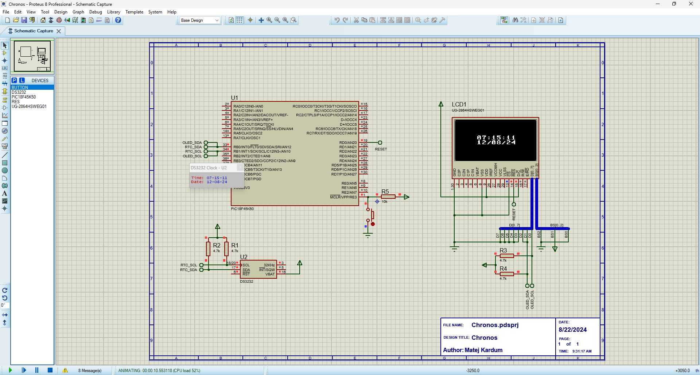

# Chronos ⌚


A digital wristwatch built around the **PIC18F** microcontroller, featuring a real-time clock and OLED display. Developed in C using MPLAB X IDE, with full schematic, PCB layout, and Proteus simulation.

---

## Features

- Displays **time** (HH:MM:SS) and **date** (DD/MM/YY) on a 128×64 OLED screen
- Uses the **DS3232** real-time clock IC for accurate timekeeping (I2C)
- **SSD1306 OLED** display driven over I2C
- Custom low-level **I2C driver** written from scratch in C
- Custom **OLED driver** with character rendering and cursor control
- Runs at **16 MHz** internal oscillator

---

## Hardware

| Component | Part |
|-----------|------|
| Microcontroller | PIC18F (MPLAB X / XC8) |
| Real-Time Clock | DS3232 |
| Display | SSD1306 128×64 OLED |
| Communication | I2C (custom driver) |
| PCB Design | KiCad |
| Simulation | Proteus |

---

## Project Structure

```
Chronos/
├── Code/Chronos.X/       # MPLAB X project (C source)
│   ├── main.c            # Main loop – reads RTC, drives display
│   ├── i2c.c / i2c.h     # Custom I2C driver
│   ├── rtc.c / rtc.h     # DS3232 RTC driver
│   ├── oled.c / oled.h   # SSD1306 OLED driver
│   ├── font.h            # Character font bitmap data
│   └── config_bits.h     # PIC18F configuration bits
├── Pcb/Chronos/          # KiCad schematic & PCB layout
├── Simulation/           # Proteus simulation project (.pdsprj)
└── Datasheets/           # DS3232 and SSD1306 datasheets
```

---

## How It Works

The PIC18F reads time and date registers from the DS3232 RTC chip over I2C every 2 seconds. The BCD-encoded values are decoded and printed character-by-character to the SSD1306 OLED display using a custom font renderer.

```
PIC18F  ──I2C──►  DS3232 (RTC)   reads: hours, minutes, seconds, date, month, year
PIC18F  ──I2C──►  SSD1306 (OLED) writes: formatted time and date strings
```

---

## Tools Used

- **MPLAB X IDE** + **XC8 Compiler** – firmware development
- **KiCad** – schematic capture and PCB layout
- **Proteus** – circuit simulation and validation

---

## Status

✅ Firmware complete  
✅ Schematic complete  
✅ PCB layout complete  
⚠️ Physical prototype not yet built (simulation only)

---

*Developed by Matej Kardum – August 2024*
